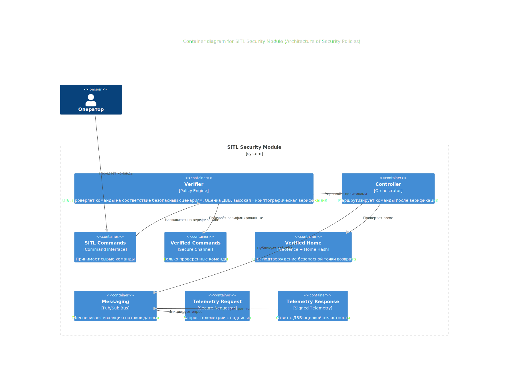
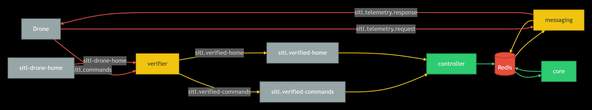

# New-SITL — SITL-система для экономики дронов

## Описание

SITL система для учебного проекта экономики дронов. Все компоненты работают через единый брокер сообщений (`SystemBus`) и наследуются от `BaseComponent`.

## Архитектура



```
new-SITL/
├── broker/                          # Брокер сообщений (Kafka/MQTT)
│   ├── src/                         #   Исходный код SystemBus
│   ├── kafka/                       #   Реализация Kafka
│   ├── mqtt/                        #   Реализация MQTT
│   └── README.md
│
├── components/                      # Компоненты SITL-системы
│   ├── sitl_messaging/              #   Запросы/ответы позиций дронов
│   ├── sitl_core/                   #   Обновление позиций дронов в Redis
│   ├── sitl_controller/             #   Обработка верифицированных команд
│   └── sitl_verifier/               #   Валидация команд
│
├── shared/                          # Общие утилиты
│   ├── state.py                     #   Состояние дронов
│   ├── contracts.py                 #   Схемы и валидация
│   └── infopanel_client.py          #   Клиент инфопанели
│
├── schemas/                         # JSON-схемы для валидации
├── sdk/                             # SDK (BaseComponent, SystemBus)
├── new-SITL/                        # Компонент-шаблон
│
└── requirements.txt                 # Зависимости проекта
```
## Расклад по ЦПБ (Центры Принятия Безопасных решений)

| ЦПБ | Компонент | Функция | Оценка ДВБ |
|-----|-----------|---------|------------|
| Центр верификации команд | verifier + sitl.verified-commands | Проверка входных команд | Средняя |
| Центр доверенной домашней позиции | sitl.verified-home | Контроль точки возврата, геозона | Средняя |
| Центр политик маршрутизации | controller | Применение активных политик к потокам, оркестрация | Высокая |
| Центр безопасной телеметрии | sitl.telemetry.request + response | Запрос/ответ с контролем целостности | Высокая |
| Центр изоляции сообщений | messaging | Разделение команд, телеметрии, событий | Средняя |

## Диаграмма архитектуры политик с оценкой ДВБ



## Шаблоны проектирования СКИБ

| Шаблон | Где применён | Как именно используется | Влияние на ДВБ |
|--------|--------------|------------------------|----------------|
| Chain of Responsibility | verifier → verified-commands | Цепочка проверок: аутентификация → валидация → белый список → подпись | Средняя |
| Memento | sitl.verified-home | Криптографический снимок безопасной home-позиции, откат | Средняя |
| Strategy | controller | Алгоритмы решений (политики) подменяются на лету | Высокая |
| Proxy | sitl.telemetry.request/response | Перехват запросов телеметрии, добавление контроля целостности | Высокая |
| Broker | messaging | Единая шина между компонентами (команды, телеметрия, события) | Средняя |


## Компоненты

### sitl_messaging
Обработка запросов позиций дронов. Читает состояние из Redis и возвращает координаты.

```bash
cd components/sitl_messaging
make docker-up
```

### sitl_core
Периодическое обновление позиций движущихся дронов в Redis.

```bash
cd components/sitl_core
make docker-up
```

### sitl_controller
Приём верифицированных команд и HOME-сообщений, сохранение состояния в Redis.

```bash
cd components/sitl_controller
make docker-up
```

### sitl_verifier
Валидация входящих команд по JSON-схемам, публикация верифицированных сообщений.

```bash
cd components/sitl_verifier
make docker-up
```

## Ключевые изменения относительно SITL-module

| SITL-module | New-SITL |
|---|---|
| Собственный `broker.py` | `SystemBus` из `broker/` |
| Прямые `asyncio.run(main())` | Компоненты на `BaseComponent` |
| Retry-логика в каждом сервисе | Обеспечивается `SystemBus` |
| Один `src/` на всё | Отдельные компоненты с полной структурой |

## Создание нового компонента

1. Скопировать любой компонент из `components/`
2. Переименовать и адаптировать `src/*.py`
3. Наследоваться от `BaseComponent`, реализовать `_register_handlers()`
4. Обновить `__main__.py`, `docker/Dockerfile`, `Makefile`

## Тесты

```bash
# Запустить тесты одного компонента
cd components/sitl_messaging && make unit-test

# Запустить все тесты
python -m pytest components/*/tests/ -v
```

## Зависимости

```bash
pip install -r requirements.txt
```
