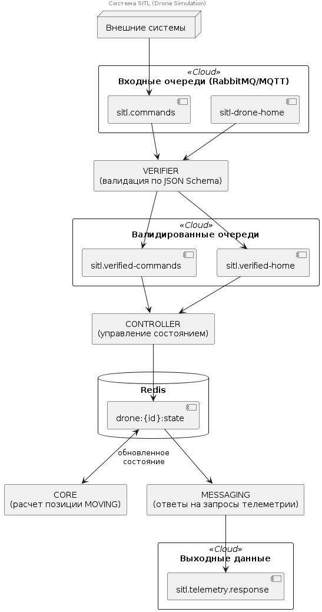

# Архитектура SITL-модуля

##  Компоненты системы

### 1. Verifier (`verifier.py`)
Ответственность: Валидация входящих сообщений

- Читает сообщения из топиков `sitl.commands` и `sitl-drone-home`
- Валидирует JSON-полезные нагрузки по JSON Schema из `schemas/`
- Публикует валидированные сообщения в `sitl.verified-commands` и `sitl.verified-home`
- Использует consumer group `SITL-verifier-v1`

### 2. Controller (`controller.py`)
 Ответственность: Управление состоянием дронов

- Читает валидированные сообщения из verified-топиков
- Создает/обновляет состояние дронов в Redis по ключу `drone:{drone_id}:state`
- Логика состояний:
  - HOME — создает базовое состояние со статусом `ARMED`
  - COMMAND с ненулевой скоростью → `MOVING`
  - COMMAND с нулевой скоростью → `ARMED`
  - Игнорирует COMMAND, если нет HOME
- Использует consumer group `SITL-controller-v1`

### 3. Core (`core.py`)
Ответственность: Расчет позиции движущихся дронов

- Работает только с Redis (не зависит от брокера)
- Периодически сканирует ключи `drone:*:state`
- Двигает только дроны со статусом `MOVING`
- Обновляет `lat`, `lon`, `alt` на основе векторов скорости `vx`, `vy`, `vz`
- Частота обновления настраивается через `UPDATE_FREQUENCY_HZ` (по умолчанию 10 Hz)
- Продлевает TTL состояния

### 4. Messaging (`messaging.py`)
Ответственность: Обработка запросов телеметрии

- Слушает запросы из `sitl.telemetry.request`
- Достает состояние дрона из Redis
- Отправляет ответ в `reply_to` или `sitl.telemetry.response`
- Поддерживает `correlation_id` для корреляции запрос/ответ
- В Kafka `correlation_id` дублируется в payload и headers
- В MQTT metadata передается только в payload

---

##  Поток данных


---

##  Инфраструктура

### Брокер сообщений (выбирается через `BROKER_BACKEND`)

Kafka:
- `zookeeper` + `kafka`
- Env: `BROKER_BACKEND=kafka`, `KAFKA_SERVERS=kafka:29092`

MQTT:
- `mosquitto`
- Env: `BROKER_BACKEND=mqtt`, `MQTT_HOST=mosquitto`, `MQTT_PORT=1883`

### Redis
- Хранение состояния дронов
- Ключ: `drone:{drone_id}:state`
- Настраиваемый TTL (по умолчанию 7200 сек)

---

##  Схемы данных

Расположены в директории `schemas/`:
- `sitl-commands.json` — валидация команд
- `sitl-drone-home.json` — валидация HOME-сообщений
- `sitl-position-request.json` — запросы позиции
- `sitl-position-response.json` — ответы позиции

---

##  Конфигурация

Основные environment variables:

| Переменная | Описание | По умолчанию |
|------------|----------|--------------|
| `BROKER_BACKEND` | Тип брокера (kafka/mqtt) | `kafka` |
| `REDIS_URL` | URL Redis | `redis://redis:6379` |
| `STATE_TTL_SEC` | TTL состояния | `7200` |
| `UPDATE_FREQUENCY_HZ` | Частота обновления позиции | `10.0` |
| `COMMAND_TOPIC` | Топик команд | `sitl.commands` |
| `HOME_TOPIC` | Топик HOME | `sitl-drone-home` |
| `VERIFIED_COMMAND_TOPIC` | Топик валидированных команд | `sitl.verified-commands` |
| `VERIFIED_HOME_TOPIC` | Топик валидированных HOME | `sitl.verified-home` |
| `POSITION_REQUEST_TOPIC` | Топик запросов телеметрии | `sitl.telemetry.request` |
| `POSITION_RESPONSE_TOPIC` | Топик ответов телеметрии | `sitl.telemetry.response` |

---

##  Docker Compose

Использует профили для выбора брокера:

```bash
# Запуск с Kafka
make up-kafka  # COMPOSE_PROFILES=kafka

# Запуск с MQTT
make up-mqtt   # COMPOSE_PROFILES=mqtt
```

Сервисы в compose:
- `zookeeper` + `kafka` (профиль `kafka`)
- `mosquitto` (профиль `mqtt`)
- `redis` (всегда)
- `verifier`, `controller`, `core`, `messaging` (всегда)

Все приложения подключаются к брокеру с retry backoff, не используя `depends_on`.

---

##  Состояния дрона

Статусы:
- `ARMED` — дрон на месте, готов к движению
- `MOVING` — дрон движется

Поля состояния:
- `lat`, `lon`, `alt` — текущая позиция
- `home_lat`, `home_lon`, `home_alt` — домашняя позиция
- `vx`, `vy`, `vz` — векторы скорости
- `speed_h_ms`, `speed_v_ms` — метрики скорости
- `mag_heading` — курс
- `last_update` — время последнего обновления

---

##  Отказоустойчивость

- Все сервисы повторяют подключение к брокеру с экспоненциальным backoff (1s, 2s, 4s, 8s, 10s)
- Position updater в core обрабатывает ошибки и продолжает работу
- TTL состояний в Redis предотвращает хранение устаревших данных
