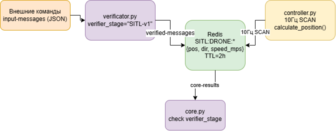
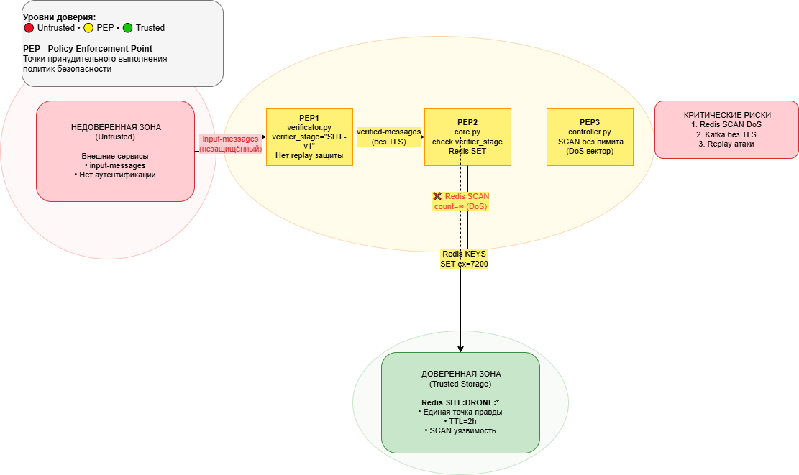

# Анализ безопасности системы SITL-module (Дрон-контроллер)

## Пункт 1. Ключевые активы, оценка уровня ущерба и приемлемость риска

### 1.1. Идентификация активов

| №  | Актив                    | Описание                                    | Категория    |
|----|--------------------------|---------------------------------------------|--------------|
| S1 | Redis состояние дронов     | Ключи `SITL:DRONE:{id}` с позициями,направлениями,скоростью всех дронов   | Хранилище    |
| S2 | Kafka топики сообщения| `input-messages`,`verified-messages`,`core-results` с командами/данными       | сообщения       |
| S3 | Переменные окружения   |  `KAFKA_SERVERS`, `REDIS_URL`, `INPUT_TOPIC`, `OUTPUT_TOPIC`      | Секреты       |
| S4 | 	Состояние consumer groups     | `SITL-verifier-v1`, `SITL-core-v1`, `SITL-drone-controller-v1`                     | Конфигурация       |
| S5 | Алгоритм расчёта позиций  | `calculate_new_position()` - единственная точка генерации координат        | Логика   |

### 1.2. Оценка уровня ущерба

| Актив              | Конфиденц.  | Целостность | Доступность | Обоснование                                                                 |
| ------------------ | ----------- | ----------- | ----------- | --------------------------------------------------------------------------- |
| S1 Redis состояния | Критический | Критический | Критический | Полный контроль над всеми дронами. DoS через SCAN блокирует 10Гц обновления |
| S2 Kafka сообщения | Высокий     | Критический | Высокий     | Replay атак, подмена команд, загрязнение пайплайна                          |
| S3 Переменные env  | Критический | Высокий     | Средний     | Доступ к инфраструктуре Kafka/Redis                                         |
| S4 Consumer groups | Средний     | Высокий     | Критический | Offset манипуляция = повторная обработка                                    |
| S5 Алгоритм        | Низкий      | Высокий     | Низкий      | Подмена логики = хаотичные траектории                                       |
|

### 1.3. Приемлемость риска

| Актив              | Приемлемость риска         | Пояснение                                                       |
| ------------------ | -------------------------- | --------------------------------------------------------------- |
| S1 Redis           | Неприемлем                 | Единственная точка правды. Компрометация = полный контроль SITL |
| S2 Kafka           | Неприемлем                 | Replay атак скрывают реальные команды                           |
| S3 env             | Неприемлем                 | Корень доверия всей инфраструктуры                              |
| S4 Consumer groups | Неприемлем для доступности | Offset reset = дублирование обработки                           |
| S5 Алгоритм        | Условно приемлем           | Симуляция, нет реальных последствий                             |
Вывод: Redis (S1) и Kafka (S2) требуют приоритетной защиты.

## Пункт 2. Роли пользователей и ключевые сценарии

### 2.1. Роли пользователей и ключевые сценарии

| Роль           | Описание                                            | Доступ                         |
| -------------- | --------------------------------------------------- | ------------------------------ |
| Внешний сервис | Отправляет команды создания/управления дронами      | Kafka input-messages           |
| Verifier       | Метит сообщения verifier_stage: "SITL-v1"           | input→verified-messages        |
| Core           | Проверяет метку, пишет состояния в Redis            | verified→Redis→core-results    |
| Controller     | Читает Redis 10Гц, симулирует полёт                 | Redis SITL:DRONE:* → состояние |
| Администратор  | Развёртывание, мониторинг, ротация consumer offsets | Docker, Kafka admin, Redis CLI |

2.2. Сценарий 1: Создание дрона

2.3. Сценарий 2: Обновление позиций 10Гц

## Пункт 3. Функциональная архитектура системы

 

### 3.1. Функциональные модули

| Компонент        | Функция                  | Входные данные             | Выходные данные         |
|------------------|--------------------------|----------------------------|-------------------------|
| Дрон-контроллер  | 10 Гц цикл               | Redis SCAN + Kafka         | MAVLink                 |
| verifier.py      | `SITL-v1` валидация      | MQTT NMEA                  | Kafka verified          |
| Redis            | Хранилище дронов         | `SITL:DRONE:001`           | JSON TTL 2ч             |
Компоненты:

verificator.py — stateless верификатор сообщений

core.py — Redis writer с проверкой verifier_stage

controller.py — 10Гц position simulator с SCAN

Redis — stateful хранилище состояний дронов TTL=2h

Kafka — message bus с 3 топиками

## Пункт 4. Цели и предположения безопасности

### 4.1. Цели безопасности

| ID   | Цель                                               | Актив | Свойство           | Приоритет   |
| ---- | -------------------------------------------------- | ----- | ------------------ | ----------- |
| SБ-1 | Целостность Redis ключей (неподменяемые состояния) | S1    | Целостность        | Критический |
| SБ-2 | Конфиденциальность Kafka (TLS/SASL)                | S2    | Конфиденциальность | Критический |
| SБ-3 | Защита от replay атак (timestamp/nonce)            | S2    | Аутентичность      | Критический |
| SБ-4 | Ограничение SCAN операций controller               | S1    | Доступность        | Высокий     |
| SБ-5 | Изоляция consumer groups по окружениям             | S4    | Авторизация        | Высокий     |

### 4.2. Предположения безопасности

| ID   | Предположение                                      |
| ---- | -------------------------------------------------- |
| ПС-1 | Redis/Kafka доступны только из Docker network      |
| ПС-2 | KAFKA_SERVERS, REDIS_URL из Docker Secrets         |
| ПС-3 | Consumer groups уникальны: SITL-verifier-v1        |
| ПС-4 | Redis ACL без FLUSHALL, только SET/GET/SCAN        |
| ПС-5 | Внешние сервисы доверяют SITL API (команды полёта) |

## Пункт 5. Моделирование угроз

### 5.1. Угроза 1: Redis DoS через SCAN

Критичность: КРИТИЧЕСКАЯ (SБ-4)

5.2. Угроза 2: Kafka Replay Attack

Критичность: КРИТИЧЕСКАЯ (SБ-3)

5.3. Критичность функций

| Функция              | SБ-1 | SБ-2 | SБ-3 | SБ-4 | Общая критичность |
| -------------------- | ---- | ---- | ---- | ---- | ----------------- |
| Redis SCAN           | ★★★  | ★    | ★    | ★★★  | Критическая       |
| Kafka verifier stamp | ★★   | ★★★  | ★★★  | ★    | Критическая       |
| Redis SET            | ★★★  | ★    | ★★   | ★★   | Критическая       |
| calculate_position() | ★★   | ★    | ★    | ★    | Высокая           |

##6. Диаграмма архитектуры политики ИБ
   
##7. Декомпозиция архитектуры и минимизация доверенных доменов безопасности
Декомпозиция SITL-модуля изолирует доверенный домен только на верификатор NMEA-сообщений. Остальное выносится в недоверенную инфраструктуру с ACL и rate limiting.

###7.1 Проблемы
Redis SCAN без лимита уязвим к DoS-атакам с полным потреблением CPU и замедлением симуляции. Kafka без SASL/TLS подвержен MITM и утечке команд дронов. Race condition в SET/SCAN вызывает неверные координаты и хаотичные траектории. Монолитный controller создает единую точку отказа. Отсутствие idempotency позволяет replay-атаки и дублирование состояний.

Сырые конфиги Redis и Kafka подвержены компрометации. Монолит из трех сервисов дает полный контроль над флотом при взломе verifier.
​​

7.2 Предлагаемая декомпозиция
Цель — TCB только верификатор NMEA в JSON, инфраструктура изолирована ACL и контейнерами.
​

TCB проверяет NMEA на синтаксис, HMAC, поля и зону СПб, формирует JSON для Kafka. Инфраструктура — Kafka ACL, Redis Lua+ACL, core для позиций, controller 10Гц с лимитом 90мс. TCB изолирован от Redis и MAVLink.

Результат — минимальная поверхность атаки, аудитируемый TCB, защищенная инфраструктура. Готово для продакшена SITL.
​
